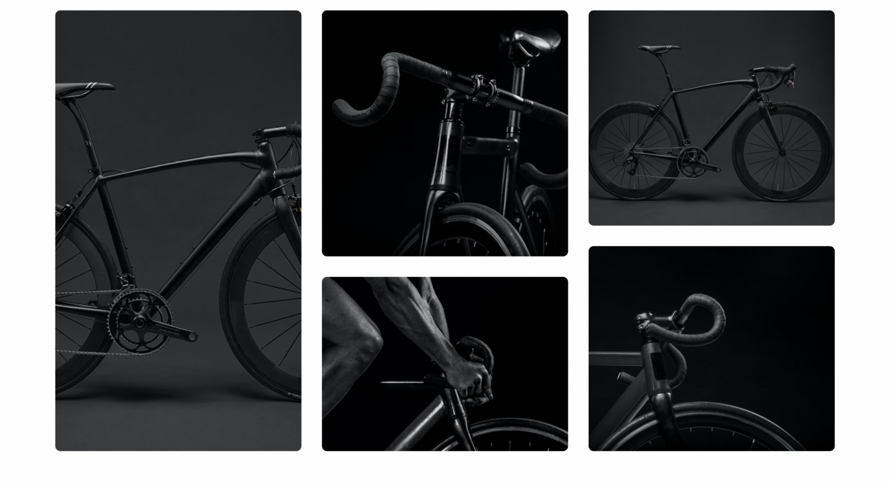

## Participants
Github: @rsarthak

Twitter: @sarthak_Raj746

Discord: Sarthak Rajput#2257

## Description
I have build a modern e-commerce storefront with medusa an 11ty.


# Set up Project
Here's how to setup and run the project locally :

**Prerequisites:**

1. Medusa CLI (npm install -g @medusajs/medusa-cli) .
2. Node Js(https://node.org/)
3. npm
4. Digital Ocean Account

## Install Project
1. Clone the repository
``` git clone git@github.com:rsarthak/medusa_store.git ```
2. change directory and install dependencies
``` cd medusa_store ```
``` medusa new my-store --seed ```
``` medusa develop ```
``` cd .. ``
``` yarn dev ```

## Resources
Here are some technologies that were useful throught the process:
1. [**Medusa's GitHub repository](https://github.com/medusajs/medusa)
2. [**Services**](https://docs.medusajs.com/advanced/backend/services/create-service/)
